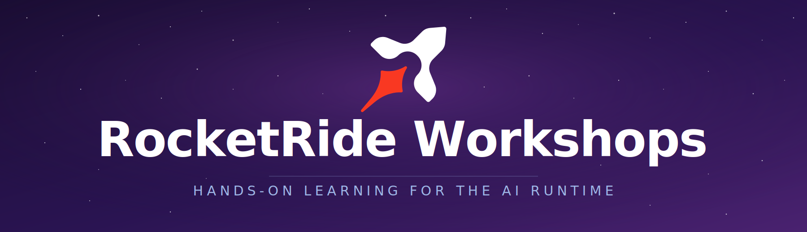

<div align="center">

<a href="https://rocketride.org">
  
</a>

<p>
  Public, hands-on workshops for the RocketRide AI runtime.<br/>
  Build real apps that integrate RocketRide — UI, API, and the runtime, end to end.
</p>

<p>
  Each workshop is a self-contained project pairing a scaffolded <code>exercise/</code> for attendees with a fully-wired <code>solution/</code> reference. Workshops focus on RocketRide integration: pipeline definitions, SDK calls, and runtime orchestration. The surrounding stack (Vite + React, FastAPI, etc.) is intentionally minimal so the spotlight stays on RocketRide.
</p>

<p>
  &nbsp;&nbsp;
  
</p>

<p>
  <a href="https://rocketride.org">Home</a> |
  <a href="https://docs.rocketride.org/">Documentation</a> |
  <a href="https://pypi.org/project/rocketride/">Python SDK</a> |
  <a href="https://www.npmjs.com/package/rocketride">TypeScript SDK</a> |
  <a href="https://pypi.org/project/rocketride-mcp/">MCP Server</a>
</p>

<p>
  <a href="https://github.com/rocketride-org/rocketride-workshops/actions/workflows/ci.yml"></a>
  <a href="https://github.com/rocketride-org/rocketride-server/releases/tag/server-v3.1.2"></a>
  <a href="https://discord.gg/9hr3tdZmEG"></a>
</p>

</div>

## Prerequisites

| Tool                                        | Version    | Purpose                                                                                                                          |
| ------------------------------------------- | ---------- | -------------------------------------------------------------------------------------------------------------------------------- |
| [Node.js](https://nodejs.org)               | `>=20`     | Runtime for pnpm and Vite tooling                                                                                                |
| [pnpm](https://pnpm.io)                     | `>=9`      | Workspace and package manager                                                                                                    |
| [Python](https://www.python.org/downloads/) | `>=3.11`   | Runs each workshop's API                                                                                                         |
| [uv](https://docs.astral.sh/uv/)            | latest     | Python environment + dependency manager                                                                                          |
| [Git](https://git-scm.com/)                 | any        | Clone the repository                                                                                                             |
| `libc++`                                    | Linux only | The bundled `engine` binary links against `libc++.so.1` — `apt install libc++1` on Debian/Ubuntu, `dnf install libcxx` on Fedora |

## Setup

1. Clone the repository.

   ```sh
   git clone https://github.com/rocketride-org/rocketride-workshops.git
   cd rocketride-workshops
   ```

2. Install everything in one command. Per-workshop `postinstall` hooks download the RocketRide runtime and sync Python dependencies — no follow-up steps required.

   ```sh
   pnpm install
   ```

3. Pick a workshop and boot UI + API + runtime together.

   ```sh
   cd workshops/coding-agent/solution
   pnpm dev
   ```

4. Open [http://localhost:5173](http://localhost:5173) — the UI calls `/api/hello`, which exercises the wired RocketRide pipeline.

## Workshops

| Workshop                                 | Stack                           | Status                                   |
| ---------------------------------------- | ------------------------------- | ---------------------------------------- |
| [coding-agent](./workshops/coding-agent) | Python · FastAPI · Vite + React | Scaffolding ready · workshop content WIP |

Each workshop ships paired directories:

- `exercise/` — scaffolded project with TODO stubs. Attendees fill these in.
- `solution/` — fully-wired reference implementation.

## How `@rocketride/runtime` works

Each workshop project's `package.json` declares the runtime version:

```json
{
  "rocketride": { "runtime": "latest" },
  "scripts": { "postinstall": "launchpad install && uv sync --directory api --all-groups" }
}
```

`launchpad install` resolves `latest` against the [`rocketride-server`](https://github.com/rocketride-org/rocketride-server/releases) GitHub releases, picks the asset for your OS (`darwin-arm64`, `linux-x64`, or `win64`), extracts it to `./.dependencies/rocketride/`, and records the version for idempotent re-installs. `launchpad start` (run by each workshop's `runtime/` sub-package) launches the extracted `engine` binary against `ai/eaas.py`.

See [`tools/launchpad/README.md`](./tools/launchpad/README.md) for details.
